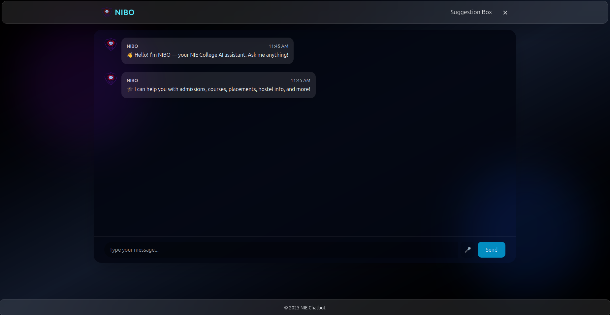

# 🎓 NIBO — NIE College Enquiry Chatbot

> NIBO is a voice-enabled, AI-powered chatbot created to answer queries about **NIE College, Mysuru** using Retrieval-Augmented Generation (RAG), vector search (FAISS), and contextual language modeling (OpenRouter API). Designed with simplicity, speed, and student experience in mind.

---
## 🖼️ Chatbot Interface Preview

Here’s a preview of **NIBO – NIE College Chatbot** in action:



## ✨ Features

- 🔍 **Semantic Search** with FAISS and MiniLM embeddings
- 🧠 **Contextual Responses** via OpenRouter LLMs (Mistral, DeepSeek)
- 🎙️ **Speech-to-Text** support using the Web Speech API
- 📮 **Feedback Collection** stored securely in Firebase
- 🪄 **Interactive Popup UI** inspired by real NIE website themes
- 🧩 **Modular Frontend** (React + Tailwind + Vite)
- 🛡️ **Clean Python Backend** with environment-based secrets

---

## 🧱 Project Structure

```
College\_Chatbot/
├── backend/
│   ├── app.py                      # Flask API entry
│   ├── rag\_pipeline.py            # RAG logic (FAISS + embeddings + OpenRouter)
│   ├── data/
│   │   └── dataset.json           # Local QA knowledge base
│   ├── embeddings/                # FAISS index and .pkl vector data
│   ├── .env                       # Environment variables
│   ├── firebase-service-key.json  # Firebase credentials
│   └── requirements.txt           # Python dependencies
├── frontend/
│   ├── src/
│   │   ├── pages/
│   │   │   ├── Chatbot.jsx        # Main chat interface with mic + loader
│   │   │   └── College.jsx        # NIE-style landing page with trigger
│   │   ├── components/
│   │   │   ├── Layout.jsx
│   │   │   ├── Header.jsx
│   │   │   ├── Footer.jsx
│   │   │   ├── ChatbotBubble.jsx  # Floating icon that opens chat
│   │   │   └── Modal.jsx          # Feedback / info popup
│   ├── public/
│   └── ...
├── .gitignore
└── README.md
```


---

## ⚙️ Setup Instructions

## 📥 Clone the Repository

```bash
git clone https://github.com/suhasbm09/College_Chatbot.git
cd College_Chatbot
```

### 🔧 Backend

```bash
cd backend
python -m venv venv
source venv/bin/activate  # Windows: venv\Scripts\activate
pip install -r requirements.txt
````

Create a `.env` file:

```env
OPENROUTER_API_KEY=your_openrouter_api_key_here
```

Then start the backend server:

```bash
python app.py
```

---

### 💻 Frontend

```bash
cd frontend
npm install
npm run dev
```

Make sure the backend is accessible at `http://localhost:5000`.

---

## 🧠 Dataset Format

```json
[
  {
    "input": "What is the admission process at NIE?",
    "response": "Admissions are based on CET/COMEDK scores and counselling..."
  },
  ...
]
```

Update `data/dataset.json` regularly for improved relevance and coverage.

---

## 🎙️ Voice Input

* Powered by the **Web Speech API**
* Click the 🎤 icon to start transcribing your voice
* Ideal for hands-free use in kiosks or info terminals

---

## 📮 Feedback with Firebase (Suggestion Box)

After interacting with the chatbot, users are encouraged to leave a suggestion or comment about their experience. This serves as a feedback loop to improve the system and address unanswered queries.

🧾 Feedback Form Includes:

    📧 Email Address

    💬 Suggestion / Query / Comment

    ⭐ Rating (1 to 5 stars)

All feedback is securely stored in Firebase Firestore, allowing developers to:

    Review suggestions for improvements

    Track user satisfaction trends over time

    Identify missing information in the chatbot knowledge base

🛠️ Setup: Create a Firebase project at console.firebase.google.com, enable Firestore, and download the service account key (firebase-service-key.json). Place it inside the backend/ directory. The backend is already configured to use this key securely.

    You can extend this system to filter, search, or export responses for future dataset enhancement or model fine-tuning.

---

## 🛠 Tech Stack

| Layer     | Tools & Libraries                          |
| --------- | ------------------------------------------ |
| Frontend  | React, Vite, TailwindCSS, Web Speech API   |
| Backend   | Flask, FAISS, SentenceTransformers, Dotenv |
| AI API    | OpenRouter (Mistral, DeepSeek)             |
| Embedding | MiniLM-L6-v2                               |
| Feedback  | Firebase Firestore                         |

---

## 📢 Acknowledgements

* [OpenRouter API](https://openrouter.ai/)
* [SentenceTransformers](https://www.sbert.net/)
* [FAISS (Facebook AI Similarity Search)](https://github.com/facebookresearch/faiss)
* [Firebase](https://firebase.google.com/)
* [NIE Mysuru Official Site](https://nie.ac.in)

---

## 🙋‍♂️ Contributors

**Suhas B M**
📧 [suhaasbm2004@gmail.com](mailto:suhaasbm2004@gmail.com)
🔗 [GitHub Profile](https://github.com/suhasbm09)

**Suhas B H**
🔗 [GitHub Profile](https://github.com/Suhas37BH) 

**Nischith S**
🔗 [GitHub Profile](https://github.com/Nischith-SV) 

**Rohan P N**
🔗 [GitHub Profile](https://github.com/rohanpn46)

---

## 📌 Disclaimer

This chatbot is **not an official product** of NIE College.
It is a **student-built AI assistant** prototype intended for demonstration and academic use only.

> Designed to inspire how AI can assist campus communities with smarter, faster access to information.

